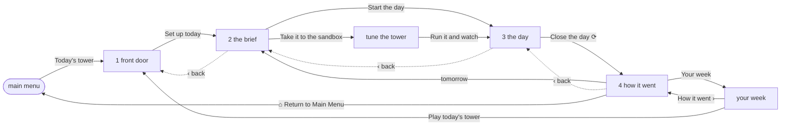
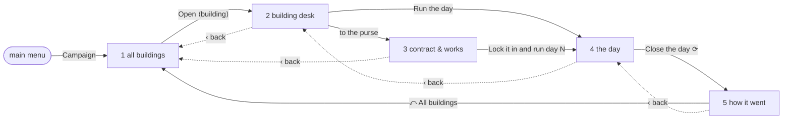

# UX flow maps — every player-facing flow, including the failure paths

**Status: SPECIFICATION, 2026-08-24. Satisfies issue #197 (M1).** Derived from the shipped code,
not from a plan. Governs no code by itself: it is the map the first-run experience (#210) is built
against, and the document the twenty-one journey rows in [`TEST_MATRIX.md`](../TEST_MATRIX.md)
should be derived from. Where this document and the code disagree, **the code is right and this
document has gone stale** — § 8 says how to re-derive it in four commands.

Cite the charter's criteria as `charter S1`…`charter S10`, never bare
([§ D343](../DECISIONS.md)). The design guide's own section numbers (`§ 3.3`, `§ 6.5`) are
`docs/design/design_handoff_casual_mode/GAMEPLAY_AND_NAVIGATION.md`'s, which
[`CLAUDE.md`](../CLAUDE.md) makes canonical for the interface.

---

## 0. What this document is, and the three things it is not

**It is an inventory of states a player can be in, and of the edges between them.** Every flow below
is mapped in **five states** — happy path, empty, restored (after a reload), unavailable, recovery —
because the charter requires it and because this repository has twice shipped a defect that lives
only in the last two columns. *A flow that is only mapped on its happy path is not mapped.*

**It is not a design document.** It proposes no screen, renames no control and moves no copy. Where
a flow is broken, this says so and points at the issue; where a flow terminates in a refusal, this
records the refusal as a **designed state** rather than a gap — [`22-charter.md`](22-charter.md)
P2's whole point.

**It is not a test plan.** § 7 proposes journey rows against `TEST_MATRIX.md` and stops there.
Editing that file is the integrator's.

**It is not a browser measurement.** Everything below is derived statically, by reading
`packages/viz/src/everyday/` and the modules it reaches. § 9 lists what that cannot settle.

### 0.1 The tree this was derived from, stated because it moved during derivation

Branch `claude/elevator-sim-charter-kickoff-rexfw8`, 2026-08-24. **The FIX-206 lane's change landed
in the working tree while this document was being written**, which is worth stating rather than
quietly absorbing: the daily and campaign flows are mapped **as repaired**, and both repaired edges
are marked ⟳ *in repair* below. On the tree that reported #206 they do not exist, and
[`ISSUE_VERIFICATION_FINDINGS.md`](../ISSUE_VERIFICATION_FINDINGS.md) § M is the account of what
they were.

Two other lanes were editing the same directory. If an edge below does not reproduce, re-derive
before reporting it — § 8.

---

## 1. The flow graph

### 1.1 How it was derived, so the next reader can re-derive it

Three files decide the whole graph, and nothing else in the tree adds an edge to it.

| Question | Answered by | How |
|---|---|---|
| What are the destinations? | `packages/viz/src/everyday/screens.ts` | `SCREEN_MODULES` — sixteen registered keys — plus `SHELL_OWNED` (`menu`). `EVERYDAY_SCREENS_BUILT` is *shell-owned ∪ registered*, derived at load |
| What are the edges the frame draws? | `packages/viz/src/everyday/actionBar.ts` | `ACTION_BAR_ROWS` — **23 rows** over 17 screen keys, split by run context where § 3.3 splits them. Each row's `back`, `timeline`, `wayOut` and `primary` is an edge or the promise of one |
| What are the edges a screen draws? | every `context.go(` in `everyday/` | **17 call sites** across nine screen modules |
| What are the edges the shell draws? | `packages/viz/src/everyday/shell.ts` | **10 `go(` call sites** — the rail rows, the settings row, the bar's back, the breadcrumb, the two way-outs, the menu primary, the mode tiles, and `doLeave` |
| Which rows appear where? | `packages/viz/src/everyday/rail.ts` | `railGroups` — `CAMPAIGN` only inside a campaign, `DESIGN` and `WORLD` always |

The commands:

```
grep -c '^  row({' packages/viz/src/everyday/actionBar.ts          # 23
grep -n 'context\.go(' packages/viz/src/everyday/*.ts | grep -v test
grep -nE '^\s*(else )?(if.*)?go\(' packages/viz/src/everyday/shell.ts
```

**Two derivations are load-bearing and neither is written down anywhere as a list.** The set of
*destinations* is derived from the registry rather than from § 4's inventory, because a key in
`EVERYDAY_SCREENS` with no module routes to a refusal rather than to a screen. And the set of
*reachable states* is `(screen × run context)`, not `screen` — the stage and the report are one
component each with four contexts (`types.ts#RunContext`), and § 3.3 gives them different bars,
different exits and different timelines per context. Mapping seventeen screens instead of
sixty-eight `(screen, ctx)` pairs is how three of § 5.2's dead ends stayed invisible.

### 1.2 The six kinds of edge

| Kind | Drawn by | Rule |
|---|---|---|
| **primary** | the bar's right-hand button | The shell's button (§ 3.1: no screen declares its own footer). A registered screen answers it through its mount handle's `primary()`; the menu and `settings` are answered by the shell itself |
| **back** | the bar's `‹ label` cell | Present only where § 3.3 names a **linear parent** — nine rows carry one, over seven distinct relations. Held in the table, never a history stack (`types.ts#EverydayState` has no `history`, and that is a rule rather than an omission). `types.ts` names five of the seven; the two it does not are the campaign and rush stage rows' own parents |
| **breadcrumb** | the bar's timeline strip | Daily is four stops, campaign is five. A *reached* stop navigates back; the current stop is never a button; a *forward* stop is live only where `shell.ts#forwardStopIsLive` says the screen behind it already holds something ⟳ |
| **leave** | the bar's left button, and the rail's *Main menu* row | Both land in `requestLeave`. Mid-run on the stage it becomes § 3.4's confirm strip; a `watch` run never warns; everywhere else it leaves at once. Leaving **clears the run context** |
| **rail sidestep** | the rail's group rows and the Settings row | A navigation that preserves the run context. Not a flow step — see § 1.7 |
| **world swap** | the rail's footer row *Switch to Engineer* | **Not a navigation.** It hands the page to the other shell and leaves this one mounted behind it ([§ D338](../DECISIONS.md)). It has no screen key and must not gain one |

### 1.3 The frame's edges — present on every screen

| Control | Target | Condition |
|---|---|---|
| Rail · *Main menu* row | `requestLeave()` | always; inert on the menu itself |
| Rail · `CAMPAIGN` group → `towers`, ⟨building⟩, `contract` | `go(screen)` | `ctx === 'campaign'` **and** the career holds a tower; the middle row only when a tower is open |
| Rail · `DESIGN` group → `workshop`, `bench`, `designer` | `go(screen)` | always |
| Rail · `WORLD` group → `week`, `board` | `go(screen)` | always. The two boards are **one** rail item |
| Rail · Settings row | `go('settings')` | always; reads `HERE` when you are on it |
| Rail · *Switch to Engineer* | `enterEngineer()` | always; no confirm strip, because the transition discards nothing |
| Bar · leave | `requestLeave()` | always except the menu |
| Bar · back | `go(row.back.screen)` | nine rows: `brief→door`, `stage/daily→brief`, `stage/campaign→building`, `stage/rush→rush`, `report/*→stage` (three rows, one relation), `building→towers`, `contract→towers` |
| Bar · breadcrumb stop | `go(stop.screen)` | reached-and-not-current, **or** forward-and-live ⟳ |
| Bar · way out (inverted rows only) | `ctx==='campaign' → go('towers')`; `ctx==='rush' → go('rush')`; else `doLeave()` | every report; a *solved* fix case |
| Bar · primary on the menu | `go(pickedMode.screen)` | the pick the tiles set |
| Menu · a mode tile | sets `modePick` **and** `ctx`, then `go(mode.screen)` | the only writer of a non-`daily` context in the tree |

### 1.4 The screens' own edges — the complete inventory

Every `context.go(` in `packages/viz/src/everyday/`, with the control that fires it.

| From | Control | To | Notes |
|---|---|---|---|
| `door` | primary *Set up today* | `brief` | guarded: a past day's replay is drawn **inert** rather than navigating |
| `brief` | primary *Start the day* | `stage` | `startRun()` first — the latching press, without which `closeShift` refuses to file ([§ D232](../DECISIONS.md)) |
| `brief` | *Take it to the sandbox* card | `tuner` | the tuner's **one shipped door**; § 3.2 forbids a rail row for it |
| `stage` | primary *Close the day* | `report` ⟳ | via `stageScreenModel.ts#stageFilingLandsOn`, asked **after** the call with what the host says happened. `undefined` — stay put — on a refused close, on a rush stage and on a watched one |
| `report` | primary | `week` | **in every context** — see § 6.1 |
| `report` | a lever card's *Open the simulator's … panel* | `stage` | **the label names a panel this does not open** — issue #213 |
| `report` | *tomorrow* button | `brief` | `openTomorrow()` first |
| `week` | a day card's *How it went ›* | `report` | today only, closed this sitting, with a sheet standing |
| `week` | primary *Play/Replay today's tower* | `door` | |
| `towers` | a row's CTA, and the primary | `building` | `open-tower` first |
| `building` | purse card's link | `contract` | |
| `building` | primary | `stage` | or, where the desk has an unanswered need, answers it **in place** and does not navigate |
| `contract` | primary *Lock it in and run day N* | `stage` | `runCampaignDay()` first |
| `workshop` | primary *Run a day with this* | `stage` | `startRun()` first |
| `designer` | primary *Run a day in it* | `stage` | applies the spec, then `startRun()` |
| `tuner` | primary *Run it and watch* | `stage` | applies **both** documents, then `startRun()` |
| `rush` | primary *Start the rush* | — | **inert**, with `rushScreenModel.ts#RUSH_PRIMARY_REFUSAL` on the control |
| `fixit` | primary *Run the day* / *Run it again* / *Next building* | — | the whole loop is in-screen; there is no report screen and no breadcrumb |
| `bench` | primary *Run the suite* | — | in-screen; inert while the field or the tests are refused |
| `board` | primary *Play today's tower* | — | **no handler at all** — see § 6.1 |
| `settings` | primary *Back to the modes* | `requestLeave()` | wired by the shell, not the screen |

### 1.5 The daily flow, drawn



### 1.6 The campaign flow, drawn



### 1.7 The run context is a latch, and the graph above is only true inside one

`shell.ts#go` preserves `ctx`; **only the mode tiles set it and only leaving clears it** — four
writers, all in one file, all found by `grep -n 'ctx:' packages/viz/src/everyday/shell.ts`: the
initial state, `requestLeave`'s watch branch, `doLeave`, and the mode tile. The rail is drawn on every screen
in every context, so a sidestep carries the context with it, and several screen primaries then read
a context that has nothing to do with the run they just started.

**The crossings that exist today, all reachable in three presses from the menu:**

| Route | What the bar then says | Why it is wrong |
|---|---|---|
| Campaign → rail *Your week* → primary → `door` → `brief` → `stage` | the **campaign** stage row: `‹ ⟨building⟩`, campaign timeline step 4, `⤺ Leave the campaign` | The run was started by the brief, not by `runCampaignDay`. The breadcrumb claims three campaign steps the player never took |
| Rush → rail *Dispatcher workshop* → *Run a day with this* → `stage` | the **rush** stage row: primary *End the rush*, note *stops the climb and counts the waves* | Nothing is climbing. This is an ordinary day |
| Rush → rail *Your week* → a card → `report` | the **rush** report row: primary *Run the rush again* | There is no rush to run again, and the primary goes to `week` |
| Campaign → rail *Your week* → a card → `report` | the **campaign** report row: primary *Back to ⟨building⟩* | The primary goes to `week` |

**This is one defect with four faces, and the fix is not four labels.** Either the context follows
the run that is on the stage rather than the tile that was last pressed, or the screens that start a
run outside a flow reset it. Naming it here because it is invisible from any single screen and from
any single test: each crossing passes every check the repository runs, and each one shows a player
a sentence about a run they did not make. It is `charter` non-goal 5's second polarity and P4's
refusal test in the same breath.

---

## 2. The five states, defined so each can fail

The charter's five columns need product-specific definitions, because one of them means something
unusual here.

| State | Definition for this product | The instrument |
|---|---|---|
| **Happy path** | Every control reachable, the run produces figures, the flow returns to a place the player chose | A journey test that presses only what a player can press |
| **Empty** | The flow entered before anything has been produced — no day closed, no case run, no suite, no rating, no week | The screen's own empty lede, and the rule that `—` is the only placeholder (`everyday/figures.ts`) |
| **Restored** | The page reloaded and the flow re-entered. **The screen is never restored** — § 3.5 forbids an entry-screen override in any storage ([§ D335](../DECISIONS.md)) — so this column is about what *data* comes back and what a screen says about the half that did not | `persist/types.ts#SessionSnapshot`, `everyday/profileStore.ts`, and the module-scope stores in § 4.4 |
| **Unavailable** | **Not an API error.** This build ships no client for the game server — `grep -rl 'fetch(' packages/viz/src` returns **one** file, `dev/data.ts`, which loads `data/*.json`. So "unavailable" has three distinct meanings here, and they are not interchangeable: (a) the **world** has no server *permanently and by design*; (b) `data/` failed to load *at boot*; (c) the browser is **denying storage** | `everyday/world.ts`, `dev/main.ts#showLoadFailure`, `persist/notice.ts` |
| **Recovery** | What the player can press to get out. A state whose only exit is a reload is **not recovered**, and this document says so rather than counting it | The edge inventory in § 1 |

**Say (a) out loud, because it changes how every board and every world figure is read.** § 16
rule 15 makes the API-absent state the *normal* one: *"Every screen renders with the API absent.
World figures degrade to a labelled `world figures unavailable` state. Never a zero, never a
spinner, never an empty chart that reads as 'nobody played'."* `everyday/world.ts` is that state as
one constant with one reason and a list of the four figures that would have been there. A flow
whose "unavailable" row says *this is the shipped state* is not under-specified; it is refusing
correctly.

---

## 3. The flows

Thirteen flows. Every one carries all five states. **F0 is not a mode** — it is the pre-flow every
other flow starts in, and it is where the two worst failure paths live.

### F0 — Cold boot and the front door

The page loads `everyday/boot.ts`, which imports `dev/main.js` for its side effect (the Engineer
surface starts booting, asynchronously, behind the cover) and then mounts the Everyday shell over
it. The shell covers `body`'s other children with `inert` + `aria-hidden`, keeps a `MutationObserver`
armed so a node arriving late is covered too, and presses the Engineer menu's *Resume* row away as
soon as it exists.

| | |
|---|---|
| **Happy** | Main menu: heading, lede, four mode tiles, and the register *What this build does not do yet*. All four tiles open (`UNBUILT_REASONS` is empty). The bar's left button reads `⌂ Modes` and is inert; the primary follows the selected card |
| **Empty** | There is no empty state. The menu is the same on the first load and the thousandth — no name, no streak, no history is required to draw it. The rail's `PLAYING AS` card falls back to `you` on sun and states *no days saved yet — close a day and it lands here*. **That wording changed with #214** and the change is the point: the card used to say *“this build keeps no career”*, which had stopped being true of the product and was, worse, the **only** line it could draw — it read a `profile` field no producer ever wrote. It now reads the week, so the empty state is a real empty state rather than the only state |
| **Restored** | **Always the main menu**, whichever world and whichever screen the player left, and this is a rule rather than a default (§ 3.5, [§ D335](../DECISIONS.md), [§ D338](../DECISIONS.md); `charter` non-goal 10). The rail's row says so on its own face (`types.ts#ENGINEER_SWAP_NOTE`) |
| **Unavailable** | **This is the hole.** If `data/` does not load, `dev/main.ts#main` calls `showLoadFailure`, which writes *could not load data/* and a **Retry** button into the Engineer transport's error slot — inside `div.shell`, which the Everyday shell has covered and inerted. The last-resort handler prepends a `<pre>` to `body`, which the cover observer inerts on arrival. The shell root is `position:fixed`, inset 0, opaque, `z-index:60`. **The player sees the main menu.** Pressing any tile mounts a registered screen with no host, which draws `host.ts#HOST_PENDING_REASON`: *"the simulation host has not finished booting — this screen draws the moment it does"* — a sentence that is **false in this state and never retracted** |
| **Recovery** | None inside the product. The Retry control exists and is unreachable; the failure text exists and is invisible. Reload is the only exit, and nothing tells the player to try one |

**This is the boot failure the charter names — two thousand tests green over a dead page — with the
cover on top of it.** It is in no issue. The cheapest honest fix is not to move the retry: it is for
the host slot to carry a *failed* arm beside its *pending* one, so `drawHostPending` can say the
other sentence. #210 builds against this flow and should not build against a state that cannot
report its own failure.

### F1 — Today's tower (the daily loop)

`menu → door → brief → stage → report → week`, four numbered stops plus the week.

| | |
|---|---|
| **Happy** | Tile → front door (pick the day, see the seven-chip week strip) → brief (elevation, the wrinkle, the dispatcher picker) → *Start the day* latches the run and mounts § 7's stage → *Close the day* files it **and opens the report** ⟳ → primary *Your week*. The report's way out `⌂ Return to Main Menu` takes the emphasis, per § 3.3's inversion |
| **Empty** | The report before any day is closed: `reportView.ts#EMPTY_LEDE` — *"No day has been closed yet, so there is nothing to report. Set up a day at the front door, watch it, and press Close the day — that is the only thing that writes this sheet."* Names no Engineer control. Your week draws seven cards of which the unplayed read *not played*; today reads *today · not closed yet*; the *How it went ›* affordance is **absent**, not disabled, on a card with nothing behind it |
| **Restored** | The week survives (`SessionSnapshot.week`). **The sheet does not** — `ViewerState` keeps one report and it is not in the snapshot. `weekView.ts` handles this explicitly: `readable` requires `dayClosed` **and** `sheetStanding`, *"because a week restored from a previous sitting carries closed days and no sheet"*. So a restored week shows closed days whose accounts cannot be opened, and offers no button that would fail. The front door's replay refusal is the same fact from the other side: a past day is **inert**, labelled *Set up the replay*, because `ViewerState` keeps one sheet |
| **Unavailable** | World figures — yesterday's world result, both histograms, the board, the style split, the percentile — all degrade to `world.ts#WORLD_FIGURES_LABEL` with `WORLD_FIGURES_REASON` and a list of the four things that would have been there. Never a zero, never a spinner. A refused mean is § 5's business |
| **Recovery** | Every screen has a leave and a back; the report inverts so the way out is the loud button. Mid-run, leaving raises § 3.4's strip: *"Leave the day unfinished? Today's run will not be scored, and the board keeps whatever you posted before."* |

**Two live hazards inside the happy path**, both in `ISSUE_VERIFICATION_FINDINGS.md` § U and
neither closed:

- `‹ The day` on the report re-mounts the stage, and `stageScreen.ts` runs
  `if (!host.runState().open) host.startRun()` on mount. After a close, `open` is false — so the
  back button **starts a new, bit-identical run**, which the Engineer's tick then auto-files behind
  the cover. Report → stage → report yields *attempt 2* with the player having asked for nothing
  (issue #215). Closing the stage↔report loop makes this reachable in one more place, which is why
  it belongs in this map rather than in that issue alone.
- A lever card's *Open the simulator's Building panel* calls `context.go('stage')` (issue #213).
  § D335 redefined the `stage` key underneath the call site.

### F2 — The campaign

`menu → towers → building → contract → stage → report`, five numbered stops.

| | |
|---|---|
| **Happy** | Tile → triage list of buildings wanting a decision → open one → answer its need, or book works from the purse → *Lock it in and run day N* → the stage → *Close the day* ⟳ → the report, whose way out is `⤺ All buildings` |
| **Empty** | `campaignScreens.ts#NO_TOWER` — *"no building is open — pick one on All buildings, and this desk is about that one until you pick another"*. A sentence, never a blank region. The rail's `CAMPAIGN` group does not draw its middle row with no tower open, because *"a desk row with an invented label would be a claim about a building nobody opened"* |
| **Restored** | **Nothing survives.** `campaign/career.ts#CAMPAIGN_ABSENCES` says so on the screen: *"The career is this session's. Nothing on these three screens is written to this device."* `SessionSnapshot` carries `week`, `parkedWeeks`, `settings` and `freePlay` and no career. A reload lands on the main menu with a fresh opening career — **and the player is not told that the campaign they were three days into has gone.** The register states the rule; nothing states the event |
| **Unavailable** | The campaign needs no server. Its two refused panels — offers, and *lately* — are drawn as refusals beside the triage list rather than omitted |
| **Recovery** | Leave clears the context and lands on the menu; the way out returns to All buildings; both desk screens carry `‹ All buildings`. The **career's own** fail state is § 8.10's: three lost contracts and the agency stops calling, at which point the contract screen's primary becomes the danger variant *Start the month again* |

**The campaign's beat 5 is broken in a second way that the loop fix does not close**, and
`docs/23` § 6 is the register of record for it: *nothing files a campaign day as cleared or
missed*. Running a day is wired end to end; marking the outcome needs `closeShift` to know which
tower it belonged to. So the report exists, the calendar cell does not move, and **the flow returns
to All buildings unchanged**. Map it as a designed absence with a named cause, not as a dead end.

### F3 — Fix a building

The one flow that closes without navigating, and the only mode `docs/23` § 6 marks as serving all
five beats.

| | |
|---|---|
| **Happy** | Tile → the case rail, opened on the **first unsolved** case → read the complaint, the figures and the diagnosis → toggle repairs against a budget → *Run the day* → a paired before/after run, in-screen → FIXED or not → *Next building* advances, wrapping. A solved case **inverts** the bar so `⌂ Return to Main Menu` takes the fill |
| **Empty** | The pre-run state is the case itself, which is never empty — eighteen authored cases, each validated against a real paired run. While the case file is loading, a *loading* line; the primary is drawn inert while `ready` is false |
| **Restored** | **Nothing survives.** `sessions` is a module-scope `Map`, so every FIXED badge, every repair toggle and every outcome is lost on reload, and the screen re-opens on the first case as though nothing had been solved. Nothing says so. This is the only mode where a player can accumulate something over an hour and lose all of it silently |
| **Unavailable** | `fixitScreen.ts` has a real data-load failure arm: *"The case file could not be loaded: …"*, drawn in alarm red |
| **Recovery** | **None from the load failure.** `loadPromise ??=` caches the *rejected* promise, so leaving and re-entering redraws the same sentence and never retries. Only a reload recovers, and the screen does not say so. Everything else recovers: `⤺ Leave this building`, and nothing on the screen is clickable but the repairs, the editor and the primary |

**And it has exactly one door.** `fixit` is in no rail group, so its only producer is the mode tile
— a player who sidesteps to the workshop and wants to come back must leave to the menu and press
the tile again, which is a full exit from the mode. `charter S10` asks that every shipped mode be
completable *without leaving it*; this one is, but it cannot be **re-entered** without leaving
something else. Worth settling before #217 promotes the mode up the tile order.

### F4 — Endless rush

**A flow that terminates in a refusal, and the refusal is the design.**

| | |
|---|---|
| **Happy** | There is none, and that is recorded rather than implied. The tile opens § 9.1's setup screen — the bands drawn off the ramp, the standings, the driving line — and the § 3.3 primary *Start the rush* is drawn **disabled** with `RUSH_PRIMARY_REFUSAL` on the control: *"the climbing stream is not built — this screen is the setup, and there is nothing behind it to start yet"* |
| **Empty** | The setup screen is its own empty state. `RUSH_ABSENCES` names four missing seams on the screen, including that *"the five entries below are the handoff's own fixtures, not runs this build measured"* |
| **Restored** | Nothing to restore; nothing is produced |
| **Unavailable** | Not applicable — the missing thing is an **engine**, not a server. `modes.ts` states the rule this follows: *where the screen exists and the thing behind it does not, the refusal belongs on the control, not on the door* |
| **Recovery** | `⤺ Leave the rush` returns to the menu. § 3.4 gives the rush its own confirm pair — *"Leave the rush? The climb is not saved, and a stopped rush has no wave to post."* — which **can never be shown**, because the strip only arms on the stage with a run open and no run can start |

### F5 — The dispatcher workshop

| | |
|---|---|
| **Happy** | Rail → the workshop: the plain levers, the term sliders, the maths disclosure, the rule rows, the switching block → *Run a day with this* starts a run and lands on the stage. Unsaved changes travel with the run, and the bar's note says which of the two is true |
| **Empty** | *Nothing changed yet* — the note's second variant, which is also what it says when nothing is mounted |
| **Restored** | The saved-dispatcher library survives (`SavedLibrary.dispatchers`, its own storage slot with its own partial-restore rule); the **working copy** does not |
| **Unavailable** | Not applicable |
| **Recovery** | `⌂ Modes`. Two § 11.5 actions are declared unbuildable and are not offered |

**Its exit is a flow crossing.** *Run a day with this* is `go('stage')` with whatever context the
player carried in — § 1.7's second and third rows.

### F6 — The test bench

| | |
|---|---|
| **Happy** | Rail → pick two to four entrants and the tests → *Run the suite* → matched crowds, paired intervals, per-cell verdicts. *Run the suite again* after |
| **Empty** | Before a run, the cards carry no verdict; the primary is drawn **inert** whenever the field or the test list is refused, with the refusal already on the screen beside the control it is about |
| **Restored** | Nothing survives a reload |
| **Unavailable** | Not applicable — the suite runs on this device |
| **Recovery** | `⌂ Modes`. Refusals are per-cell: an entrant that cannot be picked says why on itself; a field of three withdraws the pairwise verdict rather than weakening it |

The bench is where `charter S10`'s *completable without leaving the mode* is easiest to satisfy and
where the honesty rules bite hardest: `benchModel.ts`'s vocabulary (`refused`, `suppressed`,
`unmeasured`) encodes distinctions a friendlier word would collapse.

### F7 — The boards and the ladder

One screen, two tabs, one rail item — because *"two entries made the rail lie about how many places
there are"*.

| | |
|---|---|
| **Happy** | Rail → opens on the **ladder**, which needs no server: forty fixed proof cases, a rating measured on this device. Send a dispatcher → progress line with a **cancel** → a rating row |
| **Empty** | With no gauntlet run, the ladder has no rows and says what a rating is measured over (`RATING_BASIS`) |
| **Restored** | **Ratings are lost.** `RATINGS` is a module-scope `Map`. The ladder is empty again after a reload and does not say a rating was ever taken |
| **Unavailable** | The **daily board** tab is the permanent unavailable state, and it is labelled: `DAILY_BOARD_ABSENCE` — a run must be replayed and verified by a server before it appears, this build has none, *"so there are no rows here rather than invented ones"*. The proof-case file has its own load-failure line, cached the same way `fixit` caches its own — same non-recovery |
| **Recovery** | `⌂ Modes`; the gauntlet's cancel; a dirty dispatcher is refused **with the reason on the button** |

**And the primary is dead.** See § 6.1.

### F8 — Your week

| | |
|---|---|
| **Happy** | Rail → seven cards, the tally, the percentile line, the world band → today's card opens its account → primary *Play today's tower* / *Replay today's tower* returns to the front door |
| **Empty** | Seven cards reading *not played*; today reading *today · not closed yet*; the tally and percentile refusing in § 16 rule 1's em dash rather than a `0%` |
| **Restored** | The week comes back and the sheet does not (F1's *Restored* row). The card correctly stops offering its door |
| **Unavailable** | `percentileLine(dayClosed)` has exactly two arms a player can meet — *nothing to place yet* before the close, and *"Your place among today's players cannot be shown — there is no verified distribution to put your run in"* after it. **The third arm is deliberately not written**, because nothing in this build produces it |
| **Recovery** | `⌂ Modes`, and the primary |

### F9 — Design a building (the drawing board)

| | |
|---|---|
| **Happy** | Rail → author a building against the class ladder, watch the specification block re-derive as controls move → *Run a day in it* applies the spec, starts a run, lands on the stage |
| **Empty** | The board opens on the standing building, never on nothing |
| **Restored** | Saved buildings survive in the library slot; the in-progress drawing does not |
| **Unavailable** | Not applicable |
| **Recovery** | `⌂ Modes`. Its note is standing: *"Nothing here is scored. It is a drawing board."* Its own register names five things the board does not do |

### F10 — Tune the tower

**Reached from exactly one control in the shipped build**, and § 3.2 forbids it a rail row (*a thing
you do to a day, not a place you live*).

| | |
|---|---|
| **Happy** | Brief → *Take it to the sandbox* → move the three dimensions → *Run it and watch* applies both documents and lands on the stage |
| **Empty** | Nothing moved yet — the note's first variant, *Sandbox — this run will not be scored* |
| **Restored** | The saved pattern and building survive in the library; the tune does not |
| **Unavailable** | Not applicable |
| **Recovery** | `⌂ Modes`. There is **no back to the brief**, because § 3.3 gives the tuner no linear parent |
| **The gap** | § 3.2 names **two** doors and only the brief's is built. The report's third lever does not open the tuner; all four lever cards route to Engineer panels. `shell.ts`'s register carries this as an entry, and that entry is one of the strings `charter` non-goal 8 fails on |

### F11 — Settings and the profile

| | |
|---|---|
| **Happy** | Rail's gear row (which then reads `HERE`) → change the display name and the avatar swatch → the rail's `PLAYING AS` card follows **without a reload**, because the profile store notifies the shell → primary *Back to the modes* |
| **Empty** | With nothing stored: `you`, on sun, and *no days saved yet — close a day and it lands here* (#214 — see § 3's note; the old wording claimed the build kept no career, and was unconditional) |
| **Restored** | The name and colour **do** survive — `everyday/profileStore.ts` over `localStorage`, asserted by the browser tier. Nothing else on the screen persists anything |
| **Unavailable** | Storage denied is a **drawn state** here and one of only two places in the product that says so: *"This device is not keeping storage, so the name and picture last until this tab closes."* And while the Engineer surface is still booting, the Motion row is absent with *"the row appears when it has"* — a sentence that is **false if the boot failed** (F0) |
| **Recovery** | The primary and the leave are the same exit |

`SETTINGS_ABSENCES` refuses six rows, each naming what is missing rather than the feeling of it.
One adjacent finding, in no issue: the `THIS DEVICE` block asserts *"Every run you post is
re-simulated by the server before it appears on a board"* two screens from the register that says
this build has no server (`ISSUE_VERIFICATION_FINDINGS.md` § N).

### F12 — The door between Everyday and Engineer

A **mode switch**, not a navigation. Nothing is unmounted, nothing is stopped, nothing is cleared.

| | |
|---|---|
| **Happy** | Rail footer *Switch to Engineer* → `enterEngineer()`: the cover observer is disconnected **first**, then the Everyday root goes `visibility:hidden` + `inert` + `aria-hidden`, then one `resize`. Both writes in one synchronous block. The Engineer header's `‹ Everyday Mode` returns, in the mirrored order, **onto the screen the player left, with the day still open** |
| **Empty** | Not applicable — there is nothing to accumulate |
| **Restored** | **The world is not remembered, deliberately.** A reload lands on the Everyday main menu whichever world had the page, because a remembered world is § 3.5's entry-screen override wearing `localStorage` ([§ D335](../DECISIONS.md), [§ D338](../DECISIONS.md); `charter` non-goal 10). The rail's row states this on its own face rather than leaving the player to find out |
| **Unavailable** | **The trap.** `#back-to-everyday` is `hidden` in the markup and is unhidden and wired inside `dev/main.ts#boot`, which only runs on a **successful** `data/` load. On a failed boot the swap row still works — it is the Everyday shell's — so a player who presses it lands on an Engineer surface with no data and **no return control**, with the Everyday shell covered behind them |
| **Recovery** | From the normal case: the header control, and it is idempotent. From the failed-boot case: **none**. Reload only |

**Both roots are covered and neither is ever hidden**, and the symmetry is the design: `display:none`
gives a canvas a zero box and a simulator view measured while hidden paints nothing when revealed.
`visibility:hidden` keeps the box. The browser tier asserts the canvas width is identical either
side of a round trip.

---

## 4. The failure paths, named specifically

### 4.1 A refused mean, on each of the five grounds

`core/src/metrics/awtValidity.ts` holds the grounds **in precedence order, in one table, with
nowhere else for a ground to exist**. The first that fires is reported. `shift/report.ts`'s
`averageWaitFigure` publishes only when `awtIsValid && !saturated`; otherwise the cell's value is
the literal word `withheld`, the note is the run's own sentence, and the cell carries **no count**,
because a refusal has no sample.

In Everyday Mode the player reads the Casual register: `mode/disclosure.ts#suppressionLeadFor`
composes *"There is no number here, and that is a result rather than a gap: ⟨cause⟩, so
⟨consequence⟩. The measurement's reason follows, in its own words."* — and then `core`'s own
sentence, **verbatim**. The lead leads; it never replaces.

| # | Ground | Fires when | The cause clause the player reads | The consequence clause |
|---|---|---|---|---|
| 1 | `saturated` | the queue diverged over the reporting window | *the queues never settled during this run* | *no one number describes what the wait was* |
| 2 | `empty-window` | `waiting.count === 0` | *nobody finished waiting inside the stretch of the run being measured* | *there is nothing to average* |
| 3 | `abandoned` | abandonment above the limit | *too many riders gave up and left* | *the average describes the ones who stayed* |
| 4 | `censored` | unserved above the limit | *too many riders were still waiting when the clock stopped* | *an average of the rest flatters this run* |
| 5 | `starved` | a leg past the 900 s horizon | *somebody waited far longer than any average could admit to* | *the average describes a run nobody had* |

**Three things a flow map has to say about this table that a figure spec does not.**

- **The order was moved by a measurement, not by an argument.** `abandoned` sits *above* `censored`
  because the first run that abandoned anybody reported *"too many arrivals were never served"*
  about a window whose queue had drained perfectly — true, and useless, since it sends a player
  hunting a backlog that went home.
- **There is a sixth path to the `withheld` cell and it has no ground code.** The publish gate is
  `awtIsValid && !saturated`, and `suppressionClauseFor` is deliberately typed over `string` rather
  than the union so the fallback is reachable: a recording older than schema 8, or one carrying a
  ground this build has no wording for, gets `SUPPRESSION_LEAD` — the ground-free three sentences.
  A journey test that asserts a per-ground clause on every refusal will be wrong about this one.
- **Every surface that would have printed the mean must show the refusal**, and that is asserted
  separately in the left rail, right rail, report, canvas, `live/` and the exported PNG. On the
  Everyday side the refusal reaches the report's figure grid, the delta block (where a withheld cell
  pairs as the bare word and is named in the note rather than paired), and the stage's own banner.

**Where the refusal does *not* reach, in Everyday Mode:** the goals grid and the week card's score
use `PENDING_DISPLAY` — the em dash — which is § 16 rule 1's *unfinished* placeholder, a different
claim from *refused*. A journey test must not treat one as the other.

### 4.2 Saturation, specifically

Saturation is both a ground and a separate flag, and the run says so in figures: *"Queue length rose
by N persons (S/min, R× the queue's own scatter) over the W s reporting window, against thresholds
… the system is saturated, AWT is not approximately normal and its confidence interval must be
suppressed."* That sentence is what a Casual reader gets **after** the lead — issue #100's own
example of why the lead exists. On the stage, the banner takes only the *cause* half, because a
right-aligned one-line banner would arrive as an ellipsis otherwise.

### 4.3 The API unreachable

Three different things, and the map must not merge them.

| | What the player sees | Recoverable? |
|---|---|---|
| **The world** (boards, histograms, percentile, style split) | `WORLD FIGURES UNAVAILABLE` with the reason and the four named absences; the daily board tab's own labelled state | Not applicable — permanent by design |
| **`data/` at boot** | In Everyday Mode: **nothing**. The failure text and the Retry button are behind the cover (F0) | **No** |
| **A screen's own data file** (`fixit-cases.json`, `proof-cases.json`) | One red line naming the error | **No** — the rejected promise is cached; only a reload retries |

### 4.4 Storage denied, and a restore that failed

`persist/notice.ts` is a careful, complete piece of work: `restoreNoticeFor` is exhaustive over six
failure kinds (`absent`, `unavailable`, `version`, `parse`, `shape`, `stale`), returns `undefined`
for `absent` because *a first visit is not a loss*, and appends the precise message exactly where it
names something actionable. `libraryNoticeFor` is a different event (the restore succeeded and some
entries could not be reopened). `saveNoticeFor` is about the future: *nothing is being kept*.

**All three are drawn on `ui.coach.hint` in `dev/main.ts` — the Engineer coach ribbon — and on
nothing else.** In Everyday Mode they are behind the cover. A player who loses their week in
Everyday Mode is handed a fresh one and told nothing, which is precisely the defect `persist/notice.ts`
was written to close, reintroduced one shell up.

The one place Everyday Mode *does* speak about storage is the settings screen's `saveNotice`
(F11), and it is about the profile only.

### 4.5 A reload mid-flow

| What was on screen | What comes back |
|---|---|
| any screen, any context | the **main menu**, `ctx: 'daily'`, `modePick: 'today'` — by rule |
| a day mid-run | nothing; the run is gone |
| a closed day and its sheet | the **week** keeps the day; the **sheet** is gone, and the week card correctly withdraws its door |
| a campaign three days in | a fresh opening career, silently |
| solved fix-it cases | none, silently |
| a ladder rating | none, silently |
| a bench suite | none, silently |
| the display name and avatar | **kept** |
| the Engineer world | never — the swap is a fact about this visit |

**Four "silently"s in one table is the finding.** Only the week has a restore story, and only the
profile survives on the Everyday side. Everything else is a module-scope `Map` or a `let`. That is a
defensible build decision; what is not defensible is that no screen says so at the moment it
matters. `charter` P2 is the test: *does this change make the product say less?* Losing an hour of
Fix a building without a sentence is the product saying nothing at all.

### 4.6 A mode whose engine does not exist

One mode is in this state — **Endless rush** — and the pattern it establishes is the one a flow map
should hold every future mode to:

1. the tile **opens** rather than refusing, because a refused tile teaches a player the product is
   smaller than it is;
2. the screen in front of the missing engine **draws**;
3. the refusal moves onto the **control that cannot act**, disabled, with the sentence on it;
4. the screen carries its own register naming the missing seams, each by seam and not by feeling;
5. the mode tile's refusal sentence is **kept current anyway**, because it is what a reader would be
   told if the screen were ever unregistered, and a refusal describing a build two waves old is
   [§ D227](../DECISIONS.md)'s defect with a longer fuse.

---

## 5. Dead ends and unreachable states

### 5.1 Unreachable **by design**

| State | Why | Where it is said |
|---|---|---|
| `ctx: 'watch'` — the spectator context, **all of it** | § 14's spectator flow has no Everyday surface. `ctx` has four writers and none of them writes `watch` | `everyday/host.ts` names the absence: *"no watch entry"* |
| `stage`/`watch` and `report`/`watch` bar rows | Both exist so the router can answer; `report`/`watch` is marked `guide: false` because § 3.3 has no such row | `actionBar.ts`'s module docstring |
| `sublineFor`'s `WATCHING` arms; `confirmStripFor`'s watch exemption; `requestLeave`'s watch branch | Same cause | |
| `routeFor`'s `'refusal'` arm | Returns for no key on this build and **stays**, because its producer is live — it returns the moment a key has no module | `screens.ts`: *"A route with a live producer and no input today is not a dead seam"* |
| `UNBUILT_REASONS`, empty | Every § 4 key is registered. The constant and its both-directions test stay | `screens.ts` |
| The rush confirm strip | Can never be shown: it arms only on a stage with a run open, and the rush cannot start one | `actionBar.ts#confirmStripFor` |
| `menu` in any context but `daily` | `doLeave` clears the context before landing | `shell.ts#doLeave` |
| `towers` · `building` · `contract` outside `ctx: 'campaign'` | Their only producers are the campaign group, the campaign way-out and each other | `rail.ts#railGroups` |

### 5.2 Unreachable or dead **by defect**

| # | State | Evidence | In an issue? |
|---|---|---|---|
| **D1** | **The board's § 3.3 primary has no handler.** `BOARD_SCREEN` declares no `bar()` and its mount returns no `primary`. The shell's binding chain is *refusing → inert → menu → `mounted?.primary` → settings*; `board` matches none, so the button is drawn **filled, amber and enabled** with no listener. Labelled *Play today's tower* | `boardScreen.ts` (registry row); `shell.ts#drawBar` | **No** — new here |
| **D2** | **The report's primary goes to `week` in all three contexts**, while its label follows the context: *Your week* (daily, correct), *Back to ⟨building⟩* (campaign), *Run the rush again* (rush). Two of three labels name a destination the press does not reach, and the third names an action nothing performs | `reportScreen.ts` `primary: () => context.go('week')` against `actionBar.ts`'s three report rows | **No** — new here |
| **D3** | **The rush stage row is reachable, and every route to it mislabels the run.** The brief's, the workshop's, the designer's and the tuner's primaries all call `go('stage')` and all preserve `ctx`. In `ctx: 'rush'` the bar then reads *End the rush* / *stops the climb and counts the waves* over an ordinary day | § 1.7 | **No** — and it **corrects** the standing assumption that the row has no producer |
| **D4** | **Cross-flow entry into the campaign timeline.** Campaign → *Your week* → *Play today's tower* → `door` → `brief` → `stage` draws the campaign stage row with a five-stop timeline the player never walked | § 1.7 | **No** |
| **D5** | **F0's boot failure is invisible and unrecoverable**, and `HOST_PENDING_REASON` asserts a boot that will finish | § 3 F0 | **No** |
| **D6** | **F12's failed-boot swap is a one-way door** — `#back-to-everyday` is wired inside `boot()` | § 3 F12 | **No** |
| **D7** | **A failed screen data-load never retries** (`fixit`, `board`): the rejected promise is cached at module scope | `fixitScreen.ts#ensureLoaded`, `boardScreen.ts#load` | **No** |
| **D8** | **No keyboard exit anywhere in `everyday/`.** `grep -rn 'Escape\|keydown' packages/viz/src/everyday/*.ts` returns **one hit, and it is a docstring** saying the fix screen has no Escape-to-close. The shell has no key handler at all | `everyday/*.ts` | Partly — T20 is `planned` |
| **D9** | The restore, library and save notices never reach an Everyday player | § 4.4 | **No** |
| **D10** | `rail.ts#railFooter`'s streak line is **unconditional** — no producer in the tree ever supplies `streak`, so the sentence is the only string that line can render | issue #214 | Yes (#214) |

**D1 through D4 are one family**, and it is worth naming as such: **the § 3.3 bar resolves per
`(screen, ctx)` and every screen's `primary()` is one function for all contexts.** Where the two
disagree, the label is the table's and the behaviour is the function's, and nothing compares them.
`stageScreenModel.ts#stageFilingLandsOn` is the first place in the tree that asks the table which
flow it is in (`reportIsATimelineStep`) rather than assuming — that pattern is the fix for the rest
of the family, not four more labels.

---

## 6. Reachability, as a table

Seventeen keys × four contexts = 68 nominal states. **Reachable: 39.** The `watch` column is empty
by design; `menu` exists only in `daily`; the campaign screens exist only in `campaign`; `rush` and
`fixit` exist only in the context their own tile sets, because **neither has a rail row**.

| screen | daily | campaign | rush | watch |
|---|---|---|---|---|
| `menu` | ✔ | — | — | — |
| `door` | ✔ | ✔ ⚠ | ✔ ⚠ | — |
| `brief` | ✔ | ✔ ⚠ | ✔ ⚠ | — |
| `stage` | ✔ | ✔ | ✔ ⚠ D3 | — |
| `report` | ✔ | ✔ ⚠ D2 | ✔ ⚠ D2 | — |
| `towers` · `building` · `contract` | — | ✔ | — | — |
| `rush` | — | — | ✔ | — |
| `fixit` | ✔ | — | — | — |
| `workshop` · `bench` · `designer` | ✔ | ✔ | ✔ | — |
| `tuner` | ✔ | ✔ ⚠ | ✔ ⚠ | — |
| `week` · `board` · `settings` | ✔ | ✔ | ✔ | — |

⚠ = reachable, and the bar or the flow says something that is not true of the run. Every ⚠ is § 1.7.

**The `fixit` row's campaign and rush cells are the reason § 5's split matters.** Fix a building is reachable
in one context only, and not because anything guards it: it has no rail row, and its tile is the
only producer of `go('fixit')`. That is unreachable **by omission** rather than by design or by
defect — a third category this map does not need a column for, and one worth checking before #217
promotes the mode, since promoting a tile does not give a mode a way back into itself.

---

## 7. Proposed journey rows against `TEST_MATRIX.md`

**Proposals only.** [`TEST_MATRIX.md`](../TEST_MATRIX.md)'s twenty-one rows all read `planned`,
which is `charter S10`'s stated failure condition. Below: what each existing row covers against this
map, and what is missing. Nothing here edits that file.

### 7.1 The existing twenty-one

| # | Verdict | Why, against this map |
|---|---|---|
| T1 | **Reword** | *"Menu → door → brief → stage → report → week"* is F1's happy path and is now **implemented** by `dailyLoop.browser.test.ts`'s two cases — one walking the tail through the rail and one on § 3.3's primary alone. The row should say **which** of the two it means, and should name the five states rather than *"happy path"*: as written it can pass while F1's restored column is untested |
| T2 | **Covers** | F1's stage entry. `stageScreen.browser.test.ts` has the paused-at-06:00 and first-frame cases |
| T3 | **Covers** | F1's intervention. Add the `recomputing` beat as a fourth assertion — it is a drawn state (`STAGE_RECOMPUTING`) and a flow state |
| T4 | **Covers** | F5 |
| T5 | **Covers** | F5's rule rows |
| T6 | **Covers** | F1's stage pill |
| T7 | **Reword** | The ghost picker's five options are the **Engineer**'s. On the Everyday side there is no picker: `briefView.ts#GHOST_REFUSAL` and `STAGE_NO_GHOST` are the shipped state. The row should name which product it is about |
| T8 | **Reword** | F2's judging. Add: *and the calendar cell does not move, because nothing files a campaign day* — the row as written would pass over § 3's named absence and hide it |
| T9 | **Covers** | F2's purse and works |
| T10 | **Covers** | F3, and it is the strongest existing row: paired runs, before/after rows, and the nothing-else-is-clickable clause |
| T11 | **Covers** | F6 |
| T12 | **Move or mark** | The spectator flow has **no Everyday surface** (§ 5.1). This row can only be about the Engineer watch overlay. As written it reads as a gap in a flow that does not exist |
| T13 | **Covers** | F7's ladder |
| T14 | **Reword** | *"one board a day"* is a server rule and there is no server. On this build the testable claim is F7's **unavailable** row: the daily board tab draws its labelled absence and no rows |
| T15 | **Covers**, and it is the highest-value row in the file | The withheld matrix is § 4.1's fifth-ground table crossed with F1/F2/F7/F8. Add the **ground-free fallback** as a sixth column value — `SUPPRESSION_LEAD` is reachable and a per-ground assertion will be wrong about it |
| T16 | **Reword — and this is the important one** | *"API absent"* is three different states here (§ 4.3) and the row tests only the first. As written it is **already passing** on the permanent state and can never catch F0 or D7 |
| T17 | **Covers** | The corpus, measured once post-integration |
| T18 | **Covers** | Engineer |
| T19 | **Covers** | Engineer |
| T20 | **Reword** | Escape is asserted for the Engineer drawer ([§ D188](../DECISIONS.md)). In `everyday/` there is **no key handler at all** (D8). The row should say the Everyday half is a gap, not a check |
| T21 | **Covers** | |

### 7.2 Rows this map says are missing

Numbered from T22 so nothing existing is renumbered.

| # | Flow | Type | Scenario |
|---|---|---|---|
| **T22** | F0 | browser | **Cold boot with `data/` unreachable.** Every screen states the failure *in Everyday Mode*, names a recovery, and no screen claims a boot that will finish. Currently: the menu draws, tiles open, `HOST_PENDING_REASON` stands forever |
| **T23** | F12 | browser | **The swap survives a failed boot, or refuses.** Press *Switch to Engineer* with `data/` unreachable and require a way back |
| **T24** | F1 | browser | **Reload after a closed day.** The week keeps the day; the card withdraws its *How it went ›*; nothing offers a sheet that is not there |
| **T25** | F2 | browser | **Reload mid-campaign.** The career is gone by design — require the product to *say so* at the moment it matters, not only in a register |
| **T26** | F3 | browser | **Reload with cases solved.** Same shape, and the loss is larger |
| **T27** | F3, F7 | browser | **A screen's data file is unreachable.** The failure line draws, and leaving and re-entering **retries** rather than replaying a cached rejection |
| **T28** | § 1.7 | unit | **The run context never outlives its flow.** Assert `(screen, ctx)` against `ACTION_BAR_ROWS`: no reachable state may draw a bar naming a flow the run is not in. This is the one row that catches D2, D3 and D4 together |
| **T29** | § 6 | unit | **Every registered screen's § 3.3 primary is answered.** Derived from the registry: for each `(screen, ctx)`, either the mount returns a `primary`, or the resolved row is `inert`, or the shell answers it. Catches D1 and every future instance |
| **T30** | F4 | browser | **A refusal is a designed state.** The rush tile opens, the setup draws, the primary is disabled with its reason **on the control**, and the register names four seams. Asserts the refusal is *present*, which is the opposite polarity from every other row here |
| **T31** | § 4.4 | browser | **A failed restore reaches the player who is in Everyday Mode.** Currently the notice is drawn only on the covered coach ribbon |
| **T32** | § 4.1 | unit | **The Casual lead is composed for all five grounds and falls back for a sixth.** `suppressionLeadFor` over `AWT_INVALID_GROUNDS` plus one unknown code |
| **T33** | F1 | browser | **Report → `‹ The day` → report does not manufacture an attempt.** Issue #215's mechanism, now reachable in a second place |
| **T34** | all | browser | **Keyboard exit.** A key route out of every Everyday screen, or a written decision that there is none |

**T28 and T29 are the two to build first**, and not because they are cheap. They are the only two
rows in the file that would be **derived from the registry and the bar table** rather than written
per screen — which is the difference between a matrix that catches the next instance and one that
catches the last one. Every other row above is a specific journey; these two are the shape of the
defect family § 5.2 names.

---

## 8. Re-deriving this document

```
grep -c '^  row({' packages/viz/src/everyday/actionBar.ts
grep -n 'context\.go(' packages/viz/src/everyday/*.ts | grep -v '\.test\.ts'
grep -nE '^\s*(else )?(if.*)?go\(' packages/viz/src/everyday/shell.ts
grep -n 'ctx:' packages/viz/src/everyday/shell.ts
```

Four commands. The first gives the vertices and the labels, the second and third give the edges, the
fourth gives every writer of the run context — and if the fourth returns more than the four writers
§ 1.7 names, this document's reachability table is wrong.

**A fifth, for the failure paths:** `packages/core/src/metrics/awtValidity.ts`'s
`AWT_INVALID_GROUND_SPECS` is the only place a ground exists, and
`packages/viz/src/mode/disclosure.ts`'s `SUPPRESSION_CLAUSE_BY_GROUND` is the only place its Casual
wording exists. If the two ever disagree in length, one of them has gained a ground the other has no
words for — which is exactly what the widened `string` parameter and the fallback are there to
survive.

---

## 9. What could not be determined statically

Stated plainly rather than guessed at. **A browser-driven check would settle the first four and this
lane did not run one**, because two other lanes were editing `packages/viz/src/everyday/` during
derivation and a browser run would have seen a tree mid-edit.

1. **Whether F0's failure text is genuinely invisible.** The reasoning is sound — an opaque
   `position:fixed` root at `z-index:60`, a cover observer that inerts late arrivals — but *painted
   behind* is a rendering fact and this is a reading of CSS. **Settle it by:** booting with `data/`
   404ing and screenshotting.
2. **Whether the Retry button is genuinely unreachable.** `inert` swallows programmatic clicks as
   well as real ones (`boot.ts` documents having been bitten by exactly that), so the inference is
   strong. Not measured.
3. **Whether D1's board primary is truly listener-less at every moment.** The shell redraws the bar
   once after mount, specifically because a first draw resolves the row before `mounted` exists.
   `board` returns no `primary` from either draw, so the conclusion holds under both — but a screen
   that later gains one through `refreshBar` would change this, and only a click settles it.
4. **The vertical extent of the front-door register.** § N of the verification findings could not
   settle *"more vertical space than the four mode tiles combined"* from source either; it needs a
   measurement. It matters to #207 and #210, not to this map.
5. **Whether `closeShift`'s three silent early returns are reachable from Everyday Mode.**
   `stageFilingLandsOn` is written to survive all three by reading the outcome back off the host,
   which is the right shape whether or not they fire here. Which of them a *player* can produce is
   an Engineer-side question this lane did not trace.
6. **What a second concurrent shell does.** `destroy()` exists for tests and nothing in the shipped
   page calls it. Whether a second `mountEverydayShell` in one document leaves a coherent product is
   untested and unmapped.
7. **Timing.** `charter S9`'s three-second cold load has no instrument in the tree
   (`.github/workflows/` carries no load budget), so no state above carries a duration. Every "the
   moment it does" in this map is an ordering claim, never a timing one.

---

## Sources

- `packages/viz/src/everyday/` — the shell, the registry, the bar table, the rail and seventeen
  screens. The primary source for every edge in § 1.
- `packages/core/src/metrics/awtValidity.ts` — the five grounds, in precedence order, in one table.
- `packages/viz/src/mode/disclosure.ts` — the Casual wording per ground, and the ground-free
  fallback.
- `packages/viz/src/persist/` — `SessionSnapshot`, the six restore-failure kinds, and the notices.
- [`22-charter.md`](22-charter.md) — the pillars, the non-goals, and `charter S1`–`charter S10`
  ([§ D342](../DECISIONS.md), [§ D343](../DECISIONS.md)).
- [`23-audiences-and-core-loop.md`](23-audiences-and-core-loop.md) — § 4's per-mode declaration and
  § 6's register of where a mode does not serve the loop. This document maps what that one declares.
- [`ISSUE_VERIFICATION_FINDINGS.md`](../ISSUE_VERIFICATION_FINDINGS.md) §§ M, N, S, T, U, V — the
  verified mechanisms behind #206, #207, #213, #214 and #215.
- [`AGENT_STATUS.md`](../AGENT_STATUS.md) § *What is honestly still absent* — the rush engine, the
  daily board's server dependency, campaign filing, the ghost lane.
- `docs/design/design_handoff_casual_mode/GAMEPLAY_AND_NAVIGATION.md` — §§ 3.1–3.5, 4, 6–14, 16, 18.
  Canonical for what the screen looks like; never for what a number means
  ([`12-design-handoff.md`](12-design-handoff.md)).
